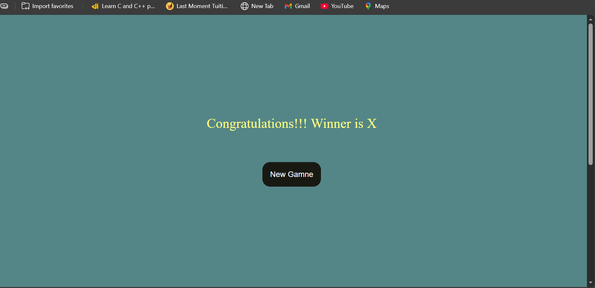
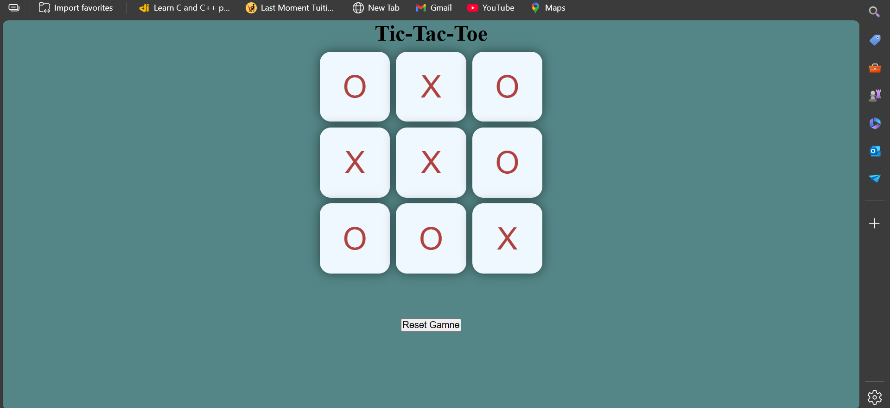

# 🎮 Tic Tac Toe Game

A simple and interactive **Tic Tac Toe** game built using **HTML, CSS, and JavaScript**.  
This project demonstrates core front-end concepts like DOM manipulation, event handling, and basic game logic.

---

## 🚀 Features

- Two-player gameplay (X vs O)
- Interactive and responsive UI
- Prevents overwriting already selected boxes
- Game reset functionality
- Clean and beginner-friendly code structure

---

## 🛠️ Technologies Used

- **HTML** – Structure of the game board
- **CSS** – Styling and layout
- **JavaScript** – Game logic and interactivity

---

## 📸 Screenshots

### Game Board


### Gameplay in Action


> 📌 *Screenshots are loaded directly from the project folder.*

---

## 📂 Project Structure

Tic-Tac-Toe/
│
├── index.html
├── style.css
├── app.js
├── img1.png
├── img2.png
└── README.md

---

## ▶️ How to Run the Project

1. Clone the repository:
   ```bash
   git clone https://github.com/Gaurav-Vennamwar/Tic-Tac-Toe.git
2.Open the project folder

3.Run the game by opening index.html in your browser

💡 Learning Outcomes

Understanding DOM selection and manipulation

Handling user events in JavaScript

Implementing simple game logic

Writing clean and structured front-end code
